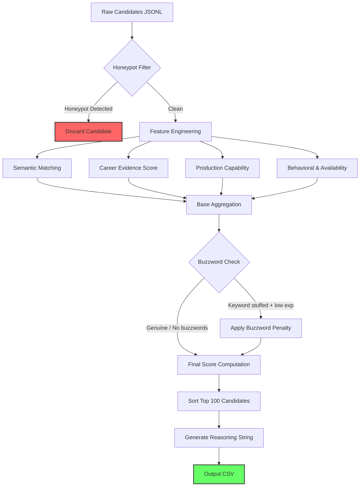
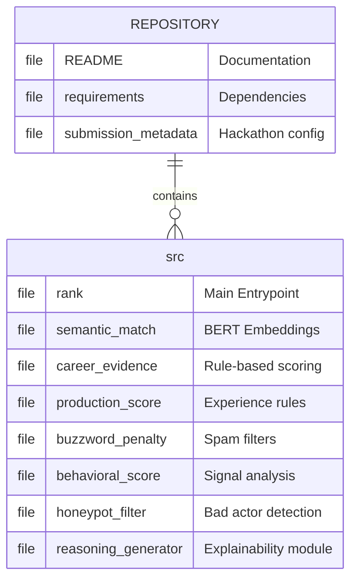

# Candidate Ranking System (Team Vibecoderzz)

This repository contains an automated pipeline to evaluate and rank 100,000 candidate profiles against a target Job Description. The system uses a combination of semantic embeddings and heuristic scoring to identify candidates with verifiable production experience in Search, Ranking, and Recommendation Systems, while explicitly filtering keyword-stuffed resumes.

## System Architecture

The pipeline processes candidates through a multi-stage funnel consisting of strict exclusion filters and weighted scoring modules.



## Setup and Execution

1. Install dependencies:
```bash
pip install -r requirements.txt
```

2. Place the dataset (`candidates.jsonl`) and the target JD (`job_description.docx`) inside the `isnt/` directory.

3. Execute the pipeline:
```bash
python src/rank.py --candidates isnt/candidates.jsonl --out team_vibecoderzz.csv
```

## Scoring Methodology

The final score is a weighted aggregation of normalized sub-scores.

| Scoring Module | Weight | Metric Measured | Penalty Condition |
| :--- | :---: | :--- | :--- |
| **Semantic Alignment** | 20% | Cosine similarity between candidate history and JD | N/A |
| **Career Relevance** | 35% | Exact matching of domain (Search, Ranking, RecSys) | Low relevance caps score |
| **Production Experience** | 20% | Scale, tools, and production environment terms | N/A |
| **Behavioral Signals** | 15% | Evidence of continuous contribution (e.g. GitHub) | N/A |
| **Availability** | 10% | Notice period and immediate start viability | N/A |
| **Buzzword Penalty** | Variable | Flags GenAI keyword stuffing | -100 if Career Score < 20 |

## Repository Structure


